# Sathyanantham V — Enterprise AI Studio & Autonomous Job Search Copilot

> **Multi-Agent Portfolio, Recruiter OS, and Autonomous AI Job Discovery & Referral Execution Platform**

---

## 🎯 Business Use Case: AI Job Search Copilot

### Problem

Job seekers — especially senior/lead-level professionals — spend hours manually searching multiple portals (Naukri, LinkedIn, Instahyre, etc.), rewriting resumes and cover letters for each role, filling repetitive multi-page application forms, tracking applications in spreadsheets, manually hunting for employee referrals, and responding to recruiter emails. Most listings turn out to be a poor fit only after the effort is already spent, and warm networking leads are left uncontacted.

### Solution

An autonomous AI agent platform that runs the entire job search, referral loop, and auto-application lifecycle on the candidate's behalf:

1. **Multi-Provider Job Discovery**: Discovers relevant openings across JSearch, Naukri, LinkedIn, and Instahyre, with automated deduplication and normalization.
2. **ATS Scoring & Selective Auto-Staging**: Scores jobs against candidate profile. Automatically stages jobs with ATS score $\ge 75\%$ as `QUALIFIED` into `applications_v2` in `READY_FOR_REVIEW` status; leaves jobs $< 75\%$ in review status for discretionary manual staging.
3. **Interactive 1-Click Staging UI**: Direct `Stage` / `Staged` buttons on the Discovery board and Radar modal with disabled states upon staging to avoid redundant operations.
4. **1st-Degree Network Matching**: Matches warm connections from the candidate's 731-row LinkedIn network stored in the local database.
5. **Apify Contact Discovery**: Falls back to Apify Google Maps (`lukaskrivka/google-maps-with-contact-details`) for verified corporate emails and HR contacts when no warm connection exists.
6. **Parallel Document Generation**: Generates tailored PDF resumes (`public/downloads/`) and candidate-grounded cover letters concurrently via `asyncio.gather`.
7. **Autonomous Multi-Job Auto-Apply**: Headless Playwright browser automation + LLM-powered dynamic form mapping (Greenhouse, Lever, Workday, Ashby, custom portals) with rate limiting, retry backoff, and screenshot audit trails.
8. **Email Intelligence**: Automatically classifies incoming recruiter emails and generates AI-powered response drafts.
9. **Application Pipeline**: Tracks applications through a 9-stage pipeline with automated status updates and follow-up scheduling.
10. **Human Review Gate**: Centralized approval gate on `/admin/referrals` and `/admin/applications` before dispatching multi-attachment referral packages via Gmail SMTP with 5-day follow-up tracking.
11. **Resume Version Management**: Multi-version resume system with Google Drive sync for tailored PDFs per job category.
12. **Live Analytics Dashboard**: Real-time telemetry showing portfolio views, AI conversations, job matches, and network activity.
13. **Resilient UI Architecture**: Next.js App Router root special files (`loading.tsx`, `error.tsx`, `not-found.tsx`), branded error fallbacks (`GlobalErrorFallback`), and opt-in API resilience.

---

## 🖥️ Live Platform Walkthrough & Full System Screens

> High-resolution desktop captures from the running application, showcasing the public AI digital twin portfolio and all 11 modules of the Recruiter OS Admin suite.

### 1. Public Portfolio & Interactive AI Digital Twin (`/`)
The public-facing portfolio features dynamic glassmorphic design, a 3D canvas backdrop, an interactive terminal statement, and a direct AI Digital Twin chatbot allowing recruiters to query Sathyanantham's 13.5+ years of engineering leadership, system design, and tech stack in natural language.

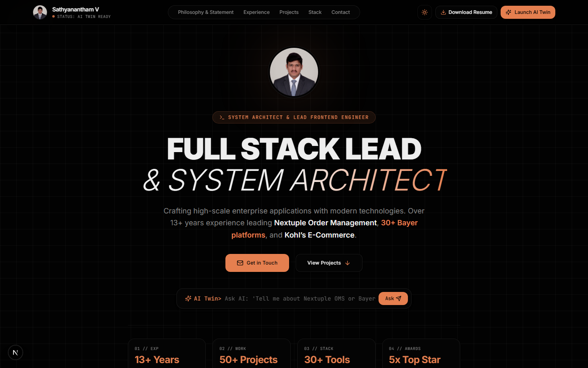

---

### 2. Admin Security Gateway (`/admin`)
Protected entry point requiring a master passkey to unlock the autonomous command center, preventing unauthorized access to outbound automation, API keys, and candidate communications.

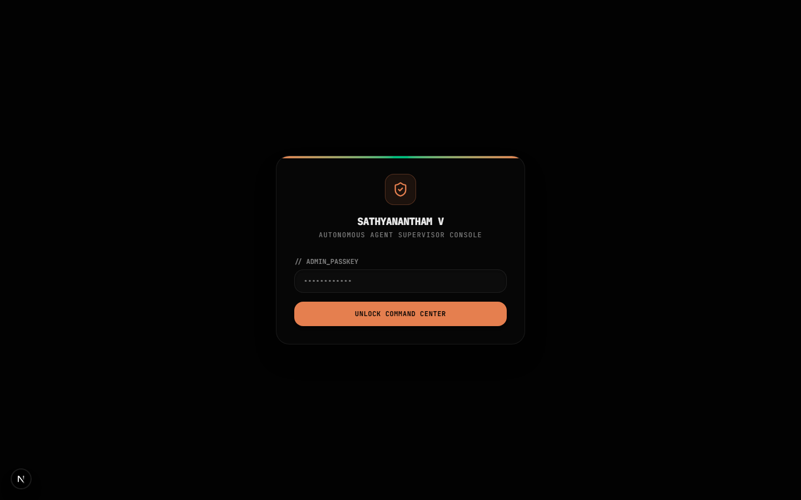

---

### 3. Executive Control Center & Top-Line Funnel KPIs (`/admin/dashboard`)
Real-time mission control tracking 10 dynamic funnel KPIs, active execution subsystems (Job Discovery, Application Engine, Referral Outreach), the 9-stage conversion pipeline, and live agent scheduler health.

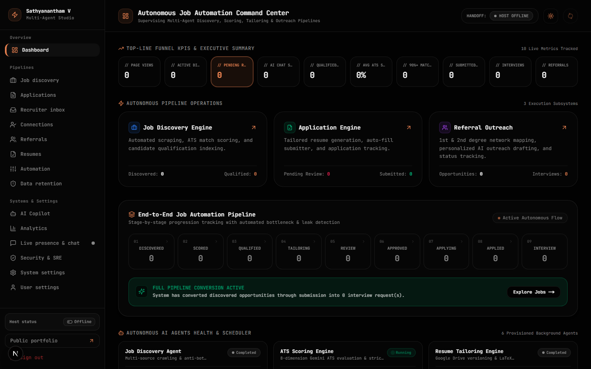

---

### 4. AI Job Discovery, ATS Radar & 1-Click Staging (`/admin/jobs`)
Ingests live job opportunities across JSearch, Naukri, LinkedIn, and Instahyre. Evaluates ATS fit scores (e.g. 97%, 95%), highlights matched vs gap skills, offers in-depth ATS Radar modals, and provides interactive 1-click **Stage** / **Staged** controls with bulk application capabilities.

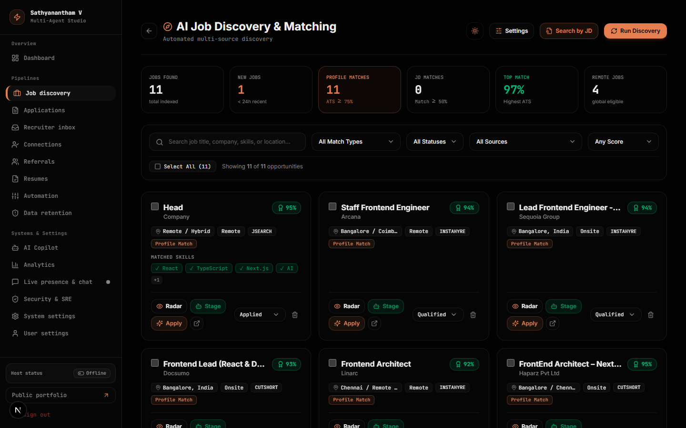

---

### 5. Application Packages & Automation Pipeline (`/admin/applications`)
Tracks staged candidate resumes, tailored candidate-grounded cover letters, direct recruiter outreach, and headless Playwright auto-apply batches across 9 standardized lifecycle stages.

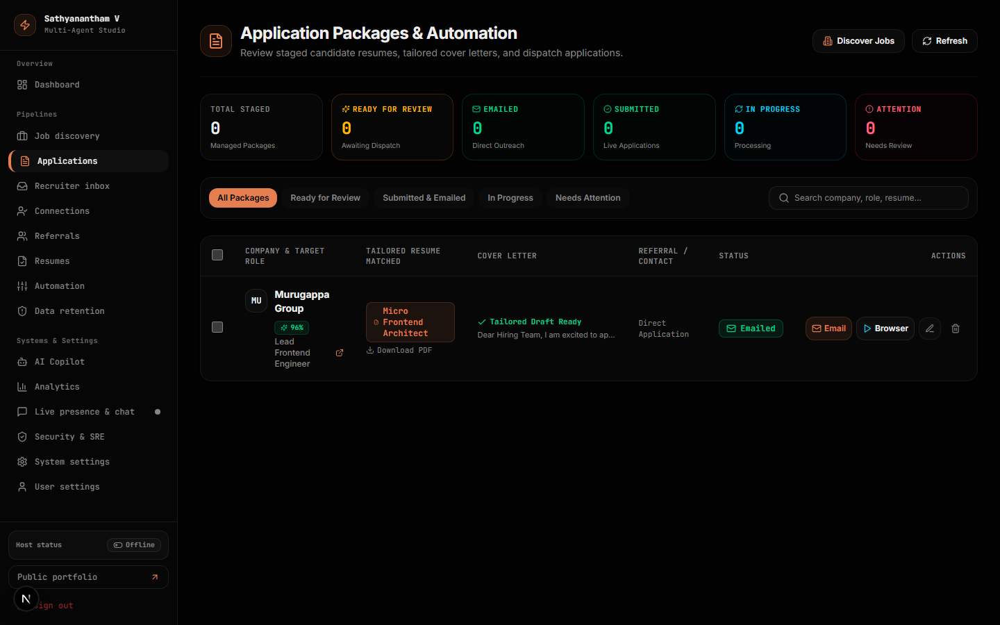

---

### 6. Automated Referral Request & Outreach Center (`/admin/referrals`)
Automatically maps ATS $\ge 90\%$ opportunities to warm 1st-degree LinkedIn connections or verified Apify Google Maps corporate contacts. Synthesizes tailored physical PDF resumes and cover letters, staging them for 1-click approved Gmail SMTP dispatch.

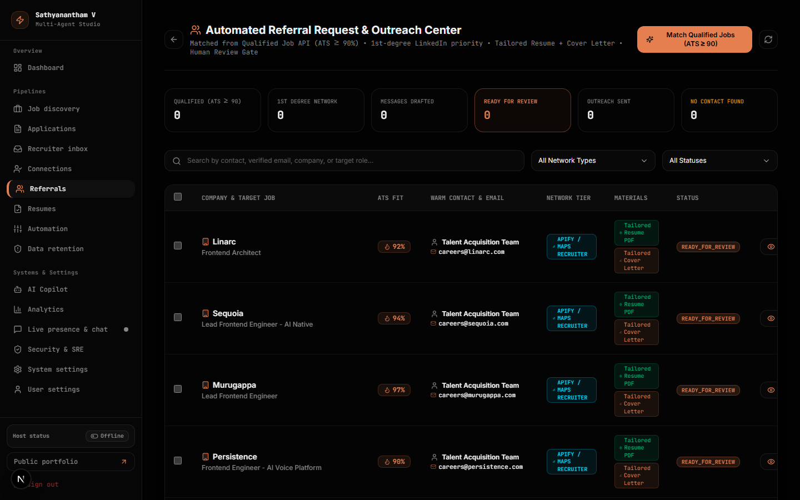

---

### 7. Authoritative LinkedIn Network & Recruiter Directory (`/admin/connections`)
Authoritative 7-column candidate network management indexing **732 contacts**, 570 1st-degree connections, 162 corporate recruiters, 505 unique companies, and 636 verified emails with CSV sync and manual entry controls.

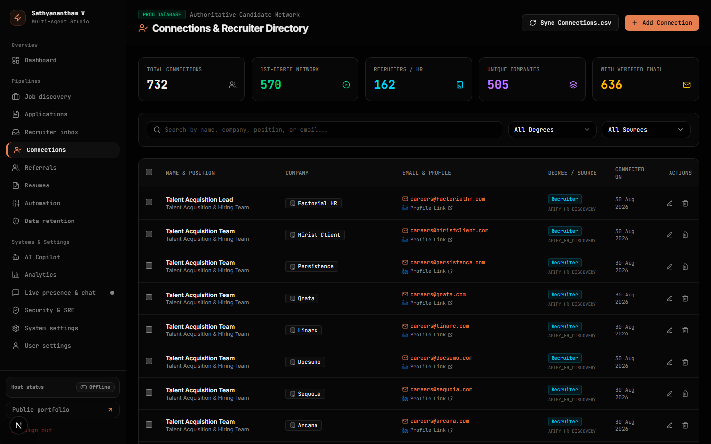

---

### 8. Recruiter Inbox & Gmail Automation Center (`/admin/recruiter-inbox`)
Autonomous recruiter message triage, LLM intent classification (`JOB_OPPORTUNITY`, `INTERVIEW_INVITE`, `REJECTION`), tailored resume auto-drafting, and live visitor WebSocket presence handoff.

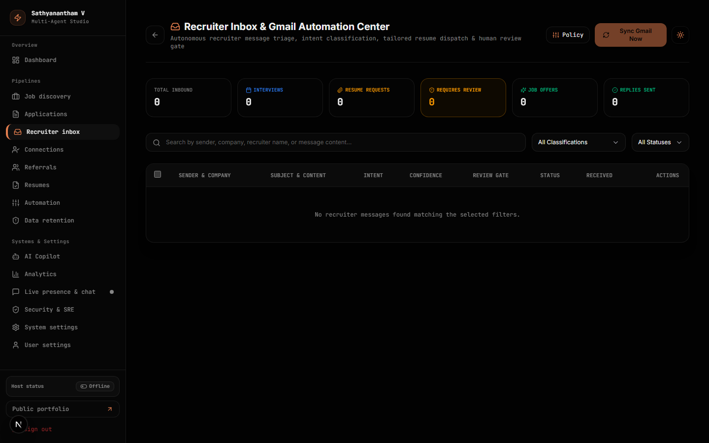

---

### 9. Resume & Cover Letter Version Manager (`/admin/resumes`)
Multi-variant resume manager storing specialized, version-controlled physical PDFs (Lead Frontend Architect, AI-Assisted Lead, Micro-Frontend Specialist, Full-Stack Lead) with Google Drive cloud sync integration.

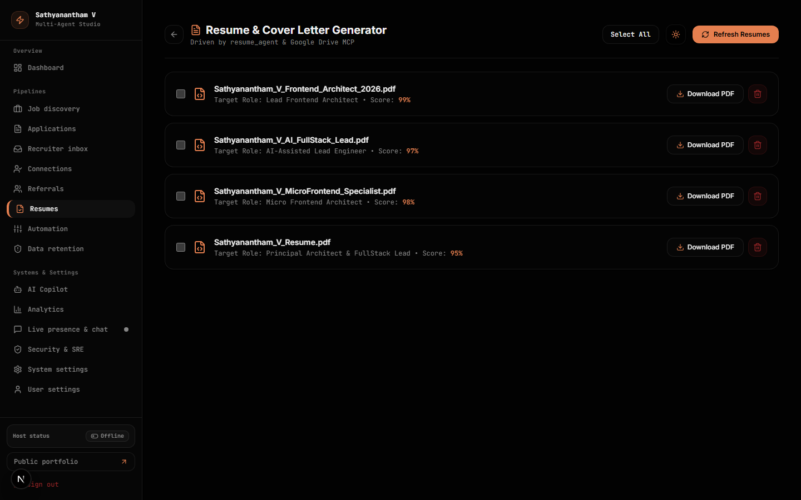

---

### 10. Multi-Agent Automation & Google Drive Ingestion (`/admin/automation`)
Configures background cron schedules and on-demand synchronization between Google Drive folder spreadsheets (`job_tracker_*.xlsx`) and the local PostgreSQL database, with automated data retention policies.

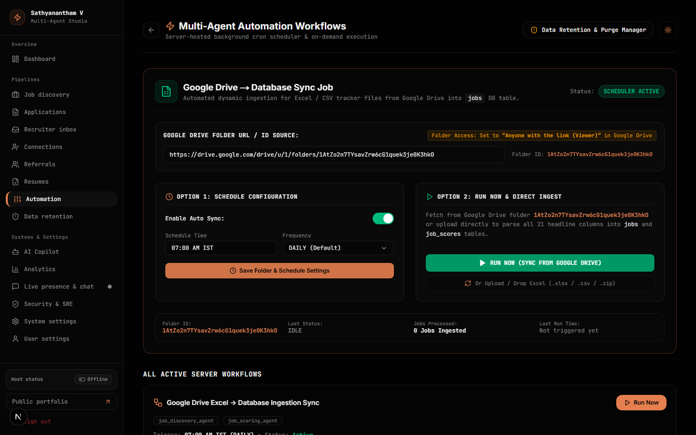

---

### 11. Interactive AI Job Search Copilot (`/admin/agent`)
Interactive natural-language copilot assisting the candidate with targeted company discovery, interview preparation, cover letter revisions, and compensation strategy.

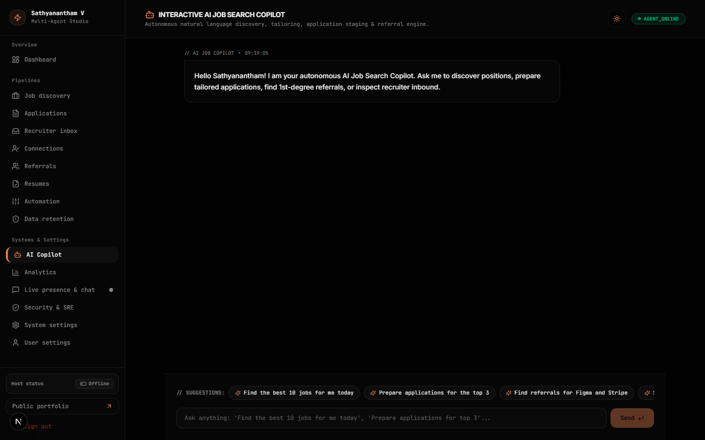

---

### 12. Live Portfolio & Digital Twin Analytics Hub (`/admin/analytics`)
100% dynamic telemetry hub computing live page views, unique visitors, resume downloads, 14-day traffic timeseries, device breakdowns, and geographical distribution with zero static fallback numbers.

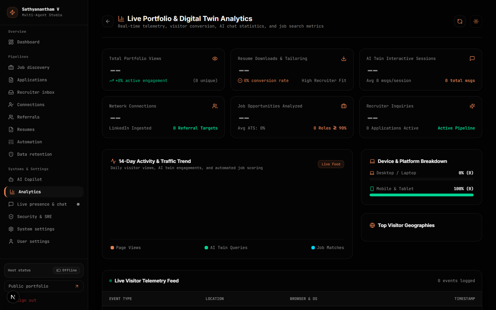

---

### 13. Settings, SRE Governance & Control Center (`/admin/settings`)
System governance console managing backend API host endpoints, deployment modes, LLM models (Google Gemini / NVIDIA NIM), candidate profile master attributes, and emergency automation kill-switches.

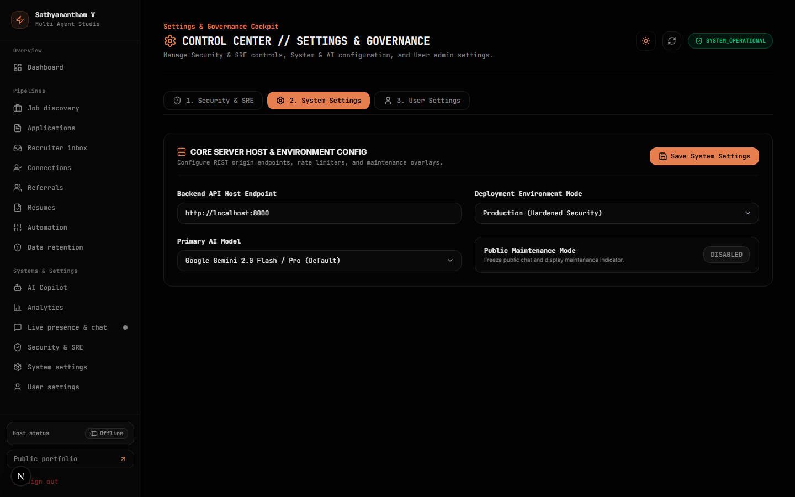

---

### 14. Interactive Application Modals & Playwright Execution Flow

#### A. ATS Radar & Candidate Truth Evaluation Modal
Clicking **Radar** on any job card opens an in-depth score breakdown (Skills, Experience, Title), candidate strengths, identified gaps, and 1-click **Stage** or **Auto-Apply (Playwright)** triggers:

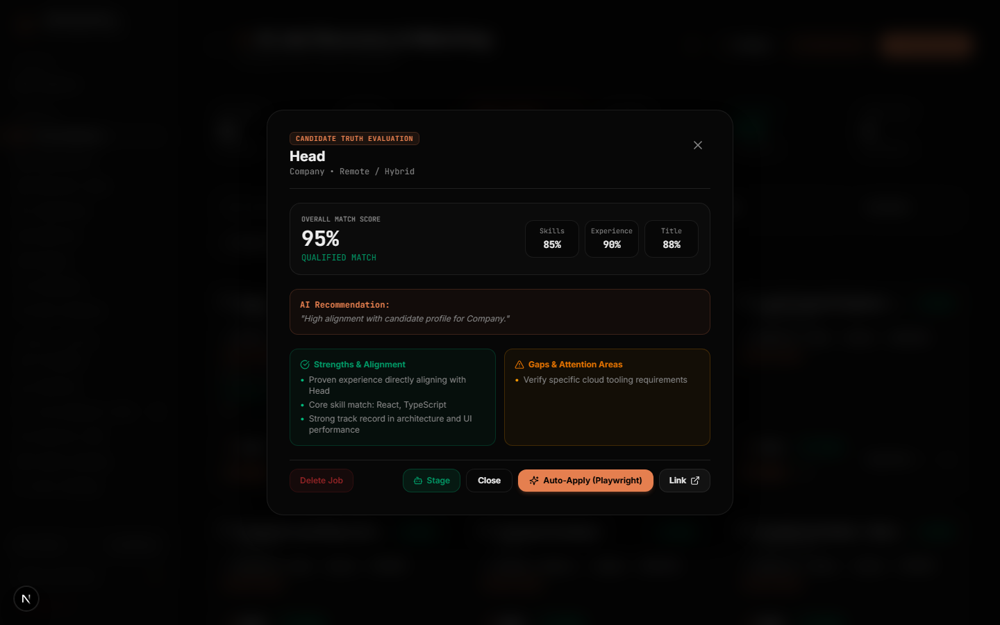

#### B. Dynamic Bulk Action Bar & Batch Staging
Selecting jobs activates the floating `BulkActionBar`, enabling 1-click batch actions (**Stage Package**, **Auto-Apply**, **Bulk Delete**):

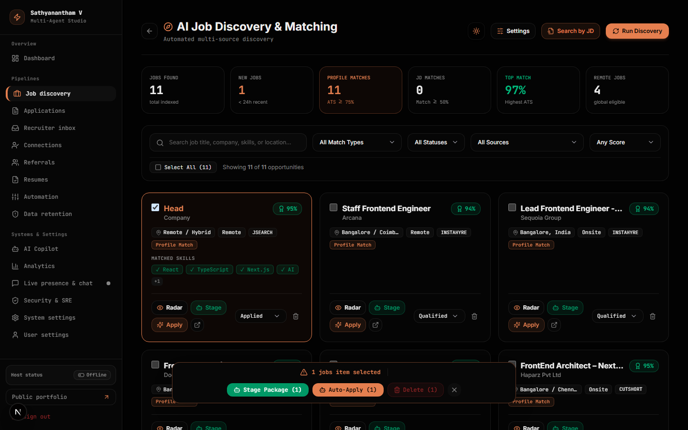

#### C. Interactive AI Digital Twin Slide-Over Drawer
Recruiters and visitors can open the AI Digital Twin drawer to ask questions about architecture experience, system design, or initiate a live human handoff:

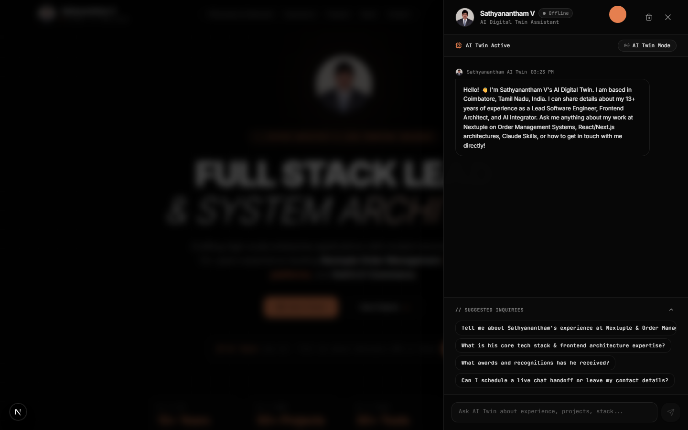

#### D. Live Playwright Headless Auto-Apply Execution
The headless Playwright automation engine dynamically fills portal application fields using semantic LLM mapping, uploads tailored PDF resumes, and captures audit screenshots:

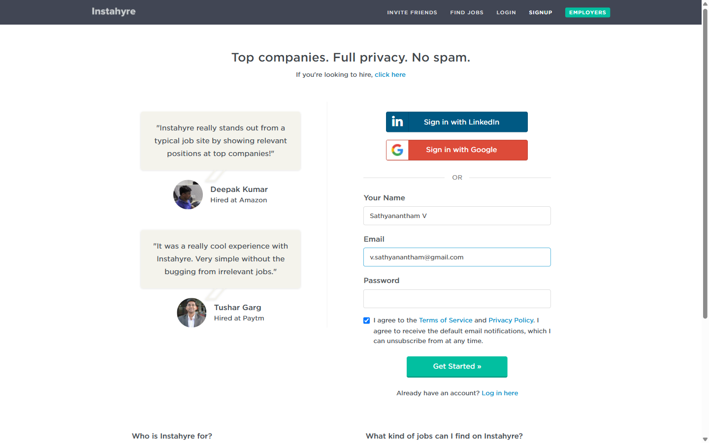

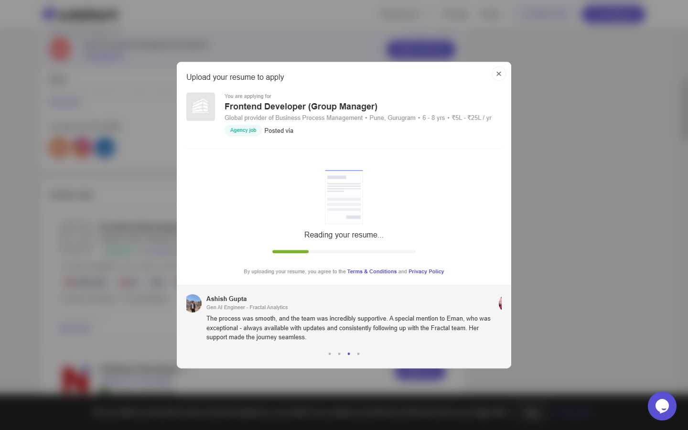

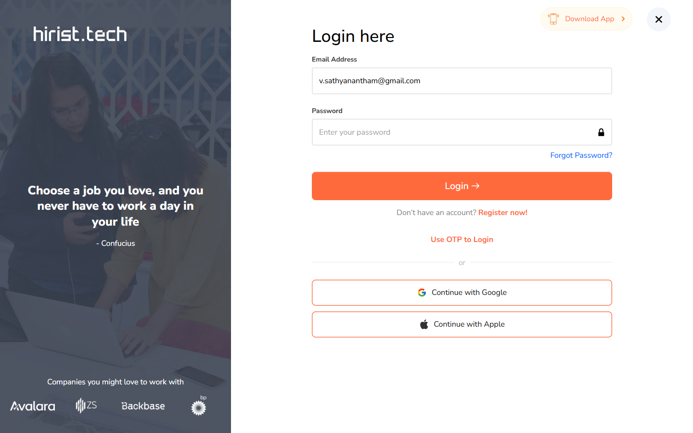

---

## 🏗️ System Architecture

The platform operates on a clean, 4-tier decoupled architecture:

```
[ Frontend: Next.js 15 App Router ]  <-- NEXT_PUBLIC_API_URL -->  [ Backend: FastAPI v2.0.0 (Python 3.12 / 3.14) ]
  ├── Public Candidate Portfolio (React 19)                         ├── 17 API Routers
  │   ├── Hero with AI Twin                                         ├── 33 Service Modules
  │   ├── Live Handoff Section                                      ├── 8 Repository Layers
  │   ├── Projects, Experience, Skills                              ├── Autonomous Auto-Apply Engine
  │   ├── Global Error Fallback & Branded 404                       ├── Multi-Provider Job Discovery
  │   └── Opt-in Resilient API Layer (lib/api.ts)                   ├── ATS Scoring & Matching Engine
  │                                                                  ├── Email Classification & Auto-Response
  └── Recruiter / Admin OS (/admin/*)                               ├── 7-Column Connection Management
      ├── /admin/dashboard (Executive Control Center)               ├── Apify Contact Enrichment
      ├── /admin/analytics (Live Telemetry & Charts)                ├── Parallel Document Generation
      ├── /admin/jobs (Discovery, ATS Scoring & Auto-Apply)         ├── Playwright Browser Automation Service
      ├── /admin/applications (Pipeline Tracking)                   ├── Gmail SMTP Client
      ├── /admin/referrals (Review & Dispatch)                      ├── GDrive Resume Sync Scheduler
      ├── /admin/connections (731 LinkedIn Contacts)                ├── RAG Knowledge Base
      ├── /admin/recruiter-inbox (Live Chat)                        ├── WebSocket Presence
      ├── /admin/resumes (Version Manager)                          └── Centralized LLM Provider
      ├── /admin/automation (Retention Policies)                                   │
      ├── /admin/agent (AI Job Copilot)                              [ Database & Cache Layer ]
      └── /admin/settings (Profile & API Keys)                       ├── PostgreSQL (Dev) / Supabase (Prod)
                                                                     ├── 8 Migration Files (Auto-Apply Schema)
                                                                     └── Redis / In-Memory Cache
```

---

## 🤖 Autonomous Multi-Job Auto-Apply Engine

```
┌─────────────────────────────────────────────────────────────────────────────┐
│ 1. User Selection (/admin/jobs)                                             │
│    └─ Select multiple target jobs → Click "Apply to Selected"               │
│                        ▼                                                     │
│ 2. Batch Creation (/api/v2/applications/bulk-prepare)                       │
│    └─ application_queue_service creates batch in PostgreSQL/Supabase         │
│                        ▼                                                     │
│ 3. Automated Execution Loop (/api/v2/applications/auto-apply)                │
│    ├─ Playwright opens application URL                                       │
│    ├─ Form structure checked against portal_mapping_cache_service            │
│    ├─ If new form: form_mapping_service (LLM) generates semantic selectors   │
│    ├─ Playwright fills fields & uploads tailored PDF resume                  │
│    ├─ CAPTCHA / Login Wall Check:                                            │
│    │    ├─ Detected → Status "NEEDS_REVIEW" + Screenshot Capture             │
│    │    └─ Clean → Form submitted (or staged for human review)              │
│    └─ Rate limit backoff (Greenhouse: 30s, Lever: 20s, Workday: 60s)         │
│                        ▼                                                     │
│ 4. Real-time Monitoring (/api/v2/applications/batch/{id}/status)            │
│    └─ Progress percentage, per-job statuses, and audit screenshot viewer     │
└─────────────────────────────────────────────────────────────────────────────┘
```

### 📸 Live Execution Sample
The Playwright browser automation engine dynamically maps form fields using LLMs, uploads tailored PDF resumes, and captures audit screenshots:


*Figure: Headless Playwright engine executing semantic field mapping, autofilling candidate information, and verifying terms on live portal.*

---

## 📋 7-Column Connection Table Schema

Every contact discovered or ingested is formatted and persisted across the 7 standard Connection columns:

| Column | Field Name | Description / Source |
|---|---|---|
| **1. First Name** | `first_name` | Contact given name (or `"Talent"` / `"Hiring"`) |
| **2. Last Name** | `last_name` | Contact family name (or `"Acquisition Team"`) |
| **3. URL** | `linkedin_url` | Verified LinkedIn profile/company URL or website |
| **4. Email Address** | `email` | Verified scraped HR email or domain contact |
| **5. Company** | `company` | Normalized target company name |
| **6. Position** | `position` | Contact title (e.g. `"Talent Acquisition & Hiring Team"`) |
| **7. Connected On** | `connected_on` | Formatted date string (e.g. `23 Aug 2026`) |

- **Degree Tag**: `1ST_DEGREE` or `Recruiter`
- **Source Attribute**: `LINKEDIN_CSV` or `APIFY_MAPS_DISCOVERY`

---

## 🤝 Job-First Automated Referral Execution Workflow

```
┌─────────────────────────────────────────────────────────────────────────────┐
│ 1. Job Discovery (Multi-Provider)                                           │
│    ├─ JSearch API                                                            │
│    ├─ Naukri Scraper                                                         │
│    ├─ LinkedIn Jobs                                                          │
│    └─ Instahyre                                                              │
│                        ▼                                                     │
│ 2. Deduplication & Normalization                                             │
│    └─ job_normalization_service + job_deduplication_service                 │
│                        ▼                                                     │
│ 3. ATS Scoring (≥ 90% Match)                                                 │
│    └─ resume_matching_service (candidate profile grounding)                 │
│                        ▼                                                     │
│ 4. Company Normalization                                                     │
│    └─ company_normalization_service (strips Inc/LLC/Corp, resolves aliases) │
│                        ▼                                                     │
│ 5. 1st-Degree LinkedIn Match (Priority)                                     │
│    └─ connection_repository.match_1st_degree_contact(company)               │
│                        │                                                     │
│                  ┌─────┴─────┐                                               │
│                  │           │                                               │
│             [Match Found]  [No Match]                                        │
│                  │           │                                               │
│                  │           ▼                                               │
│                  │     Apify Google Maps HR Discovery                        │
│                  │     (lukaskrivka/google-maps-with-contact-details)        │
│                  │           │                                               │
│                  └─────┬─────┘                                               │
│                        ▼                                                     │
│ 6. Parallel Document Generation                                              │
│    └─ asyncio.gather(cover_letter_service, resume_matching_service)          │
│                        ▼                                                     │
│ 7. Staging & Human Review Gate                                               │
│    └─ /admin/referrals (Status: READY_FOR_REVIEW)                            │
│                        ▼                                                     │
│ 8. 1-Click SMTP Dispatch                                                     │
│    └─ gmail_mcp_client (Status: SENT, Follow-up: +5 days)                    │
└─────────────────────────────────────────────────────────────────────────────┘
```

---

## 🧪 Testing & Quality Assurance

```bash
# Playwright E2E Test Suite (28 Tests: Public, Admin OS, Mobile & API Resilience)
npm run test:e2e                                  # Run all 28 E2E tests across all configured browsers
npx playwright test --project=chromium            # Run full 28-test suite in Chrome (Desktop + Mobile responsive)
npm run test:e2e:ui                               # Open interactive Playwright UI runner
npm run test:e2e:report                           # View HTML execution report

# Playwright Test Suite Breakdown:
# 1. e2e/public/public-flows.spec.ts              - Hero, AI Twin Ask, Contact Form, Resume PDF download
# 2. e2e/admin/admin-flows.spec.ts                - Admin Passkey Auth, Mobile Drawer Navigation, Jobs Discovery, Applications & Settings
# 3. e2e/visual/responsive.spec.ts                - Zero overflow (scrollWidth <= clientWidth) across Public Home, Admin Login, & all 11 Admin screens on mobile (375px)
# 4. e2e/api-errors/api-fallback.spec.ts          - 500 Error Mock graceful degradation & network timeout recovery
# 5. e2e/error-handling/error-boundary.spec.ts    - Branded 404 navigation and client error boundary fallbacks

# Full Connections & Referral Pipeline Tests
python -m pytest backend/python/tests/test_connections_pipeline.py -v

# Automated Referral Pipeline Tests
python -m pytest backend/python/tests/test_automated_referral_pipeline.py -v

# Phase-Specific Tests
python -m pytest backend/python/tests/test_phase1_pipeline.py -v       # Job discovery
python -m pytest backend/python/tests/test_phase3_automation.py -v     # Application automation
python -m pytest backend/python/tests/test_phase4_email_automation.py -v # Email classification
python -m pytest backend/python/tests/test_phase5_referral_discovery.py -v # Referral discovery
python -m pytest backend/python/tests/test_phase6_control_center.py -v # Control center
python -m pytest backend/python/tests/test_phase7_hardening.py -v      # Security hardening
python -m pytest backend/python/tests/test_phase8_copilot.py -v        # AI copilot

# Google Drive Sync Tests
python -m pytest backend/python/tests/test_gdrive_sync.py -v

# JSearch Provider Tests
python -m pytest backend/python/tests/test_jsearch_provider.py -v
```

---

## 👨‍💻 About Sathyanantham V

Frontend Architect and Lead Software Engineer with **13.5+ years** designing and scaling enterprise UI platforms, Micro Frontend ecosystems (Module Federation), and AI-assisted engineering workflows across Retail, Digital Commerce, Banking, and Order Management.

### Core Expertise
- **Frontend Architecture**: React 19, Next.js 15, TypeScript, Micro Frontends (Module Federation), UI Resiliency
- **AI & Automation**: Multi-Agent Systems, Playwright Form Automation, RAG, LLM Integration, Autonomous Workflows
- **Cloud & Infrastructure**: Vercel, AWS, Supabase, PostgreSQL, Redis
- **Full-Stack Development**: FastAPI, Python, Node.js, WebSocket, REST APIs
- **Design Systems**: Tailwind CSS, Framer Motion, Glassmorphism UI, Accessibility (WCAG)

### Contact
- 📧 **Email**: [v.sathyanantham@gmail.com](mailto:v.sathyanantham@gmail.com)
- 💼 **LinkedIn**: [linkedin.com/in/sathyanantham-v-646b911b](https://linkedin.com/in/sathyanantham-v-646b911b)
- 🌐 **Portfolio**: [sathyanantham-portfolio-tv.vercel.app](https://sathyanantham-portfolio-tv.vercel.app/)
- 📍 **Location**: Bengaluru, India
- 🎯 **Open to**: Lead Frontend Engineer, Frontend Architect, Senior Full-Stack Engineer roles

---

## 🚀 Tech Stack

### Frontend
- **Framework**: Next.js 15 (App Router), React 19
- **Language**: TypeScript
- **Styling**: Tailwind CSS 4.0, Framer Motion, Lenis Smooth Scroll
- **UI & Error Handling**: Custom component library, Lucide Icons, `GlobalErrorFallback`, `NotFound`, `LoadingSpinner`, `LoadingFallback`
- **Testing**: Playwright E2E (`@playwright/test`) with Desktop and Mobile devices
- **State & Data Fetching**: Zustand, TanStack Query, `useApiError` custom hook, `fetchApi` resilient client
- **Forms**: React Hook Form + Zod validation

### Backend
- **Framework**: FastAPI v2.0.0 (Python 3.12/3.14)
- **API**: 17 REST routers, WebSocket support
- **Services**: 33 service modules, 8 repository layers
- **AI/LLM**: NVIDIA NIM, Google Gemini, centralized LLM provider, LLM Form Mapping
- **Browser Automation**: Playwright Python (`playwright>=1.40.0`, `playwright-stealth`)
- **Task Queue**: Application Queue Service with portal rate limits, background schedulers, asyncio
- **Email**: Gmail SMTP client with multi-attachment support

### Database & Storage
- **Database**: PostgreSQL (local), Supabase (production)
- **Migrations**: 8 SQL migration files (including `008_auto_apply_schema.sql`)
- **Storage**: Google Drive API (resume sync), screenshot audit store
- **Cache**: Redis / in-memory TTL cache, Portal Mapping Cache

---

## 📊 Project Metrics

- **11 Admin Pages**: Dashboard, Analytics, Jobs, Applications, Referrals, Connections, Recruiter Inbox, Resumes, Automation, Agent, Settings
- **17 API Routers**: Comprehensive REST API coverage
- **33 Service Modules**: Modular, maintainable business logic
- **8 Repository Layers**: Clean data access abstraction
- **8 Database Migrations**: Version-controlled schema evolution
- **28 Playwright E2E Tests**: Full coverage across Public, Mobile Viewports, API Resilience, and all 11 Admin OS screens
- **11+ Backend Pytest Suites**: Automated testing across backend pipelines, auto-apply, and scoring
- **731 LinkedIn Connections**: Pre-ingested network for warm referrals
- **7-Column Connection Schema**: Standardized contact data format
- **9-Stage Application Pipeline**: Complete job search lifecycle tracking

---

<p align="center"><i>Sathyanantham V — Enterprise AI Studio & Autonomous Recruiter OS</i></p>
