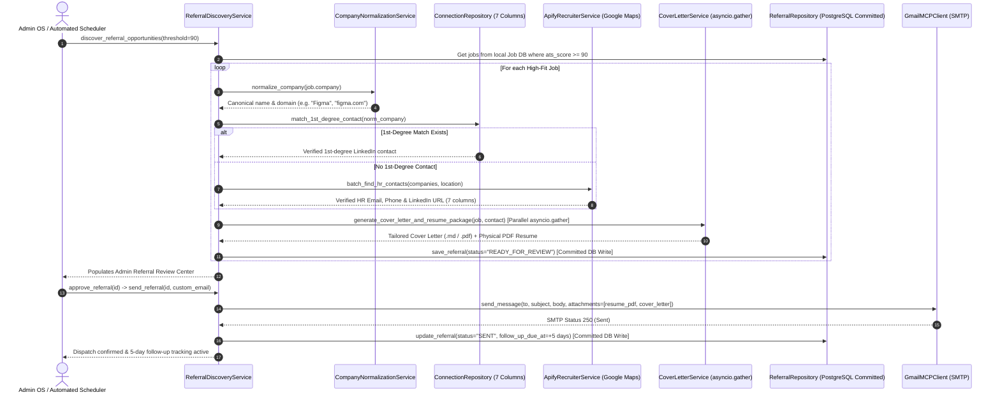

# Business Use Case: AI Job Search Copilot

## Problem

Job seekers — especially senior/lead-level professionals — spend hours manually searching multiple portals (Naukri, LinkedIn, Instahyre, etc.), rewriting resumes and cover letters for each role, and tracking applications in spreadsheets. Most listings turn out to be a poor fit only after the effort is already spent, and relevant postings get missed simply because no one checked that day.

## Solution

An autonomous AI agent platform that runs the entire job search and referral loop on the candidate's behalf:
1. Discovers and scores jobs against the candidate profile (ATS $\ge$ 90%).
2. Queries the local Job DB directly without re-running external scrapers.
3. Matches warm 1st-degree connections from the candidate's 731-row LinkedIn network.
4. Enriches corporate contacts via Apify Google Maps (`lukaskrivka/google-maps-with-contact-details`) for verified HR emails and phones.
5. Formats all contacts across the standard 7 Connection columns (`First Name`, `Last Name`, `URL`, `Email Address`, `Company`, `Position`, `Connected On`).
6. Generates candidate-grounded cover letters and pairs tailored physical PDF resumes (`public/downloads/`) in parallel via `asyncio.gather`.
7. Staging and human review gate on `/admin/referrals` before 1-click SMTP dispatch with physical attachments and 5-day follow-up tracking.

---

## 🎯 System Architecture Overview

The platform operates on a clean 4-tier decoupled architecture:

```
[ Frontend: Next.js 15 App Router ]  <-- NEXT_PUBLIC_API_URL -->  [ Backend: FastAPI (Python 3.12 / 3.14) ]
  ├── Public Candidate Portfolio (React 19)                         ├── 6 Autonomous AI Agents
  └── Recruiter / Admin OS (/admin/*)                               ├── Job Discovery Engine
      ├── /admin/dashboard (100% Dynamic 10 KPIs)                   ├── 7-Column Connection Table Persistence
      ├── /admin/analytics (Live Telemetry & 14-Day Trends)         ├── Apify Google Maps Contact Scraper
      ├── /admin/referrals (Job-First ATS ≥ 90% Flow)               ├── Parallel Document Generation (asyncio.gather)
      ├── /admin/connections (731 LinkedIn Contacts)                └── Live Handoff & Visitor Telemetry
      └── /admin/agent (AI Job Copilot Chatbot)                                    │
                                                                       [ Database & Cache Layer ]
                                                                        ├── PostgreSQL (Local) / Supabase (Prod)
                                                                        └── Redis / In-Memory TTL Cache
```

1. **Frontend (`app/`, `components/`, `lib/`)**: Next.js 15 App Router. Public portfolio and Admin OS (`/admin/dashboard`, `/admin/analytics`, `/admin/jobs`, `/admin/applications`, `/admin/referrals`, `/admin/connections`, `/admin/recruiter-inbox`, `/admin/resumes`, `/admin/automation`, `/admin/agent`, `/admin/settings`). All frontend API calls resolve dynamically through `getApiHost()` via `NEXT_PUBLIC_API_URL`.
2. **Backend Engine (`backend/python/`)**: FastAPI server housing 6 autonomous AI agents, centralized LLM evaluation, background scheduler loop, and WebSocket presence handoff.
3. **Analytics & Telemetry Engine (`backend/python/api/analytics.py`)**: Exposes `GET /api/v2/analytics/overview` aggregating `visitor_events`, `chat_sessions`, `chat_messages`, `jobs`, `applications`, `referrals`, and `connections` with zero static numbers.
4. **Connections & Referral Engine (`backend/python/services/`)**: Apify Google Maps contact scraper, 7-column schema mappings, 1st-degree LinkedIn matching, candidate truth grounding, and multi-attachment SMTP client.
5. **Database & Data Lifecycle Layer (`backend/python/repositories/`)**: Dual-engine persistence supporting Local PostgreSQL in development and Supabase in production with cascade transactions, explicit `pg_conn.commit()`, and UUID formatting.

---

## 🤝 Job-First Automated Referral Execution Engine



---

## 📋 7-Column Connection Table Schema

Every contact discovered or ingested is formatted and persisted across the 7 standard Connection columns:

| Column | Field Name | Description / Source |
|---|---|---|
| **1. First Name** | `first_name` | Contact given name (or `"Talent"` / `"Hiring"`) |
| **2. Last Name** | `last_name` | Contact family name (or `"Acquisition Team"`) |
| **3. URL** | `linkedin_url` | Verified LinkedIn profile/company URL or website |
| **4. Email Address** | `email` | Verified scraped HR email or domain contact |
| **5. Company** | `company` | Normalized target company name |
| **6. Position** | `position` | Contact title (e.g. `"Talent Acquisition & Hiring Team"`) |
| **7. Connected On** | `connected_on` | Formatted date string (e.g. `23 Aug 2026`) |

---

## 🚀 Key Operational & Test Commands

```bash
# 1. Run Complete Connections & Referral Pipeline Test Suite (100% Pass)
python -m pytest backend/python/tests/test_connections_pipeline.py -v

# 2. Run Automated Referral Pipeline Tests
python -m pytest backend/python/tests/test_automated_referral_pipeline.py -v

# 3. Trigger High-Fit Job-First Referral Discovery
curl -X POST "http://127.0.0.1:8000/api/v2/referrals/discover?threshold=90"

# 4. Fetch Live Telemetry Overview
curl "http://127.0.0.1:8000/api/v2/analytics/overview"
```
