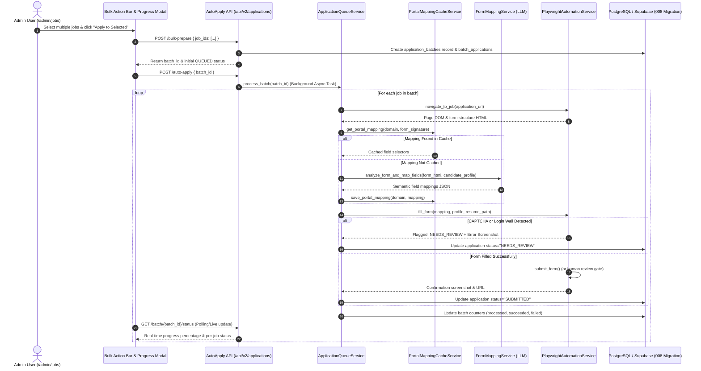
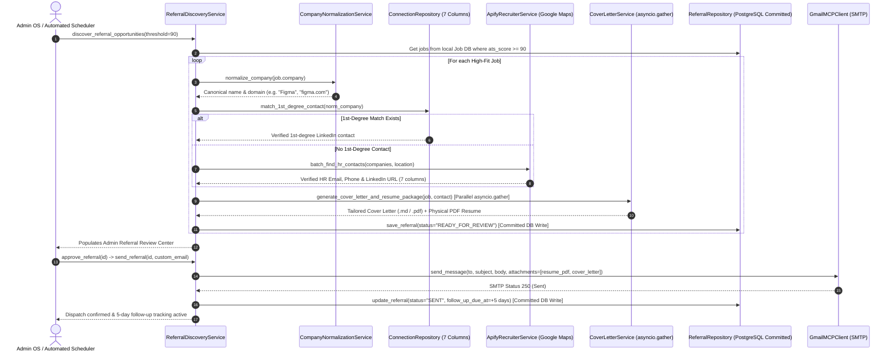

# Business Use Case: AI Job Search Copilot

## Problem

Job seekers — especially senior/lead-level professionals — spend hours manually searching multiple portals (Naukri, LinkedIn, Instahyre, etc.), rewriting resumes and cover letters for each role, manually filling repetitive multi-page application forms, and tracking applications in spreadsheets. Most listings turn out to be a poor fit only after the effort is already spent, and relevant postings get missed simply because no one checked that day.

## Solution

An autonomous AI agent platform that runs the entire job search, referral loop, and auto-application lifecycle on the candidate's behalf:
1. **Job Discovery & Scoring**: Discovers and scores jobs against the candidate profile (ATS ≥ 90%) via JSearch, Naukri, LinkedIn, and Instahyre scrapers.
2. **Local Job Database**: Queries the local Job DB directly (`job_repository`) without re-running external scrapers.
3. **1st-Degree Network Matching**: Matches warm 1st-degree connections from the 731-row LinkedIn network ingested from `docs/Connections.csv`.
4. **Contact Enrichment**: Enriches corporate contacts via Apify Google Maps (`lukaskrivka/google-maps-with-contact-details`) for verified HR emails and phones.
5. **7-Column Connection Format**: Formats all contacts across the standard 7 Connection columns (`First Name`, `Last Name`, `URL`, `Email Address`, `Company`, `Position`, `Connected On`).
6. **Parallel Document Generation**: Generates candidate-grounded cover letters and pairs tailored physical PDF resumes (`public/downloads/`) in parallel via `asyncio.gather`.
7. **Human Review Gate**: Staging and human review gate on `/admin/referrals` before 1-click SMTP dispatch with physical attachments and 5-day follow-up tracking.
8. **Autonomous Multi-Job Auto-Apply**: Headless Playwright browser automation + LLM-powered dynamic form mapping (Greenhouse, Lever, Workday, Ashby, custom portals) with rate limiting, retry backoff, and screenshot audit trails.
9. **Email Classification & Auto-Response**: Automatically classifies incoming recruiter emails and generates AI-powered responses.
10. **Application Lifecycle & Resilient UI**: Full application pipeline tracking with automated status updates, opt-in API resilience, theme-aware error boundaries, branded 404, and Playwright E2E test suites.

---

## 🎯 System Architecture Overview

The platform operates on a clean 4-tier decoupled architecture:

```
[ Frontend: Next.js 15 App Router ]  <-- NEXT_PUBLIC_API_URL -->  [ Backend: FastAPI (Python 3.12 / 3.14) ]
  ├── Public Candidate Portfolio (React 19)                         ├── 17 API Routers & 33+ Service Modules
  │   ├── Hero with AI Twin & Interactive Canvas                    ├── Multi-Provider Job Discovery Engine
  │   ├── Global Error Boundary & Branded 404                       ├── ATS Scoring & Matching Engine
  │   └── Opt-in Resilient API Layer (lib/api.ts)                   ├── 7-Column Connection Table Persistence
  │                                                                  ├── Apify Google Maps Contact Scraper
  └── Recruiter / Admin OS (/admin/*)                               ├── Autonomous Auto-Apply Orchestrator
      ├── /admin/dashboard (100% Dynamic 10 KPIs)                   ├── LLM Form Mapping & Cache Engine
      ├── /admin/analytics (Live Telemetry & 14-Day Trends)         ├── Playwright Browser Automation Service
      ├── /admin/jobs (Job Discovery, Scoring & Bulk Auto-Apply)    ├── Email Classification & Auto-Response
      ├── /admin/applications (Pipeline & Automation Batches)       ├── GDrive Resume Sync Scheduler
      ├── /admin/referrals (Job-First ATS ≥ 90% Flow)               ├── Parallel Document Generation (asyncio.gather)
      ├── /admin/connections (731 LinkedIn Contacts)                ├── RAG Knowledge Base Ingestion
      ├── /admin/recruiter-inbox (Live Handoff Chat)                └── Live Handoff & Visitor Telemetry
      ├── /admin/resumes (Version Manager & GDrive Sync)                           │
      ├── /admin/automation (Retention & Lifecycle)                  [ Database & Cache Layer ]
      ├── /admin/agent (AI Job Copilot Chatbot)                      ├── PostgreSQL (Local) / Supabase (Prod)
      └── /admin/settings (Candidate Profile & API Keys)             └── Redis / In-Memory TTL Cache
```

1. **Frontend (`app/`, `components/`, `lib/`, `hooks/`)**: Next.js 15 App Router with React 19. Public portfolio and Admin OS with 11 admin pages. Root special error handling (`app/loading.tsx`, `app/error.tsx`, `app/not-found.tsx`), UI primitives (`GlobalErrorFallback`, `NotFound`, `LoadingSpinner`, `LoadingFallback`), and opt-in API resilience hook (`useApiError.ts`).
2. **Backend Engine (`backend/python/`)**: FastAPI v2.0.0 server with 17 API routers, 33 service modules, 8 repository layers, WebSocket support, and Google Drive sync scheduler.
3. **Auto-Apply Engine (`backend/python/services/`)**:
   - `application_queue_service.py`: Orchestrates multi-job batch applications, portal-specific rate limiting (Greenhouse: 30s, Lever: 20s, Workday: 60s), and exponential backoff retry.
   - `playwright_automation_service.py`: Playwright browser automation for DOM inspection, field filling, file uploads, CAPTCHA/login wall detection, and audit screenshots.
   - `form_mapping_service.py`: LLM-powered structural semantic analysis and heuristic fallback patterns.
   - `portal_mapping_cache_service.py`: Persistent cache with reliability statistics and auto-deprecation on form changes.
4. **Analytics & Telemetry Engine (`backend/python/api/analytics.py`)**: 100% dynamic metrics from `visitor_events`, `chat_sessions`, `chat_messages`, `jobs`, `applications`, `referrals`, `connections`, and `emails`.
5. **Job Discovery Services**: Multi-provider integration (JSearch, Naukri, LinkedIn, Instahyre) with deduplication, normalization, ATS scoring, and automated matching.
6. **Referral & Connection Engine**: 1st-degree LinkedIn matching, Apify contact discovery, company normalization, parallel cover letter + resume generation, and Gmail SMTP with 5-day follow-up.
7. **Database & Data Lifecycle**: PostgreSQL/Supabase dual support with 8 migration files (including `008_auto_apply_schema.sql`), explicit transaction commits, UUID handling, and automated data retention policies.

---

## 🤖 Autonomous Multi-Job Auto-Apply Architecture



---

## 🤝 Job-First Automated Referral Execution Engine



---

## 📋 7-Column Connection Table Schema

Every contact discovered or ingested is formatted and persisted across the 7 standard Connection columns:

| Column | Field Name | Description / Source |
|---|---|---|
| **1. First Name** | `first_name` | Contact given name (or `"Talent"` / `"Hiring"`) |
| **2. Last Name** | `last_name` | Contact family name (or `"Acquisition Team"`) |
| **3. URL** | `linkedin_url` | Verified LinkedIn profile/company URL or website |
| **4. Email Address** | `email` | Verified scraped HR email or domain contact |
| **5. Company** | `company` | Normalized target company name |
| **6. Position** | `position` | Contact title (e.g. `"Talent Acquisition & Hiring Team"`) |
| **7. Connected On** | `connected_on` | Formatted date string (e.g. `23 Aug 2026`) |

---

## 🚀 Key Operational & Test Commands

```bash
# Backend Server
python -m uvicorn backend.python.main:app --host 127.0.0.1 --port 8000 --reload

# Frontend Server
npm run dev  # Runs on http://localhost:3000

# Playwright E2E Test Suite (Desktop Chrome, Mobile Chrome, Mobile Safari)
npm run test:e2e        # Run all headless E2E tests
npm run test:e2e:ui     # Open interactive Playwright UI runner
npm run test:e2e:report # View HTML execution report

# Backend Test Suites
python -m pytest backend/python/tests/test_connections_pipeline.py -v
python -m pytest backend/python/tests/test_automated_referral_pipeline.py -v
python -m pytest backend/python/tests/test_phase1_pipeline.py -v
python -m pytest backend/python/tests/test_phase8_copilot.py -v

# Key API Endpoints
curl "http://127.0.0.1:8000/api/v2/analytics/overview"                      # Live telemetry
curl "http://127.0.0.1:8000/api/v2/jobs?min_score=90"                       # High-fit jobs
curl -X POST "http://127.0.0.1:8000/api/v2/referrals/discover?threshold=90" # Referral discovery
curl "http://127.0.0.1:8000/api/v2/connections"                             # LinkedIn network
curl "http://127.0.0.1:8000/api/v2/applications"                            # Application pipeline
curl -X POST "http://127.0.0.1:8000/api/v2/applications/bulk-prepare"       # Auto-apply batch preparation
curl -X POST "http://127.0.0.1:8000/api/v2/applications/auto-apply"         # Auto-apply execution
curl "http://127.0.0.1:8000/api/v2/control-center/pipeline"                 # 9-stage pipeline view
```

---

## 📊 Core Services & Repositories

### Services (`backend/python/services/`)
- **Auto-Apply & Form Automation**: `application_queue_service.py`, `playwright_automation_service.py`, `form_mapping_service.py`, `portal_mapping_cache_service.py`
- **Job Discovery & Matching**: `job_discovery_service.py`, `job_scoring_service.py`, `job_normalization_service.py`, `job_deduplication_service.py`, `resume_matching_service.py`
- **Referral & Networking**: `referral_discovery_service.py`, `referral_messaging_service.py`, `referral_ranking_service.py`, `linkedin_contact_service.py`, `apify_recruiter_service.py`
- **Communication**: `gmail_mcp_client.py`, `email_classification_service.py`, `cover_letter_service.py`, `websocket_service.py`, `notifications.py`
- **Infrastructure**: `ai_providers.py` (NVIDIA/Gemini LLM), `rag_service.py`, `gdrive_sync_service.py`, `gdrive_sync_scheduler.py`, `resilience_service.py`
- **Automation & Governance**: `application_automation_service.py`, `recruiter_automation_service.py`, `retention_service.py`, `kill_switch_service.py`, `audit_governance_service.py`
- **Candidate Management**: `candidate_profile_service.py`, `company_normalization_service.py`, `website_contacts_enrichment_service.py`
- **AI Copilot**: `ai_job_copilot_service.py`

### Repositories (`backend/python/repositories/`)
- `job_repository.py` - Jobs & job scores (PostgreSQL + Supabase)
- `application_repository.py` - Applications & application events
- `referral_repository.py` - Referral campaigns with committed transactions
- `connection_repository.py` - 7-column connection schema + CSV ingestion
- `email_repository.py` - Email storage & classification results
- `resume_repository.py` - Resume versions & GDrive sync metadata
- `retention_repository.py` - Data lifecycle & retention policies
- `supabase_repo.py` - Core DB helper with dual PostgreSQL/Supabase support

### API Routers (`backend/python/api/`)
- `auto_apply.py` - Autonomous multi-job application batches, progress polling & retry
- `analytics.py` - Live telemetry & metrics aggregation
- `jobs_v2.py` - Job discovery, scoring, and pipeline
- `applications.py` - Application tracking & automation
- `referrals.py` - Referral discovery & outreach management
- `connections.py` - LinkedIn network CRUD & sync
- `recruiter_inbox.py` - Live visitor handoff & chat
- `resumes.py` - Resume version management & GDrive sync
- `control_center.py` - Executive dashboard & 9-stage pipeline
- `copilot.py` - AI job search assistant chat
- `portfolio.py` - Dynamic portfolio data (projects, experience, skills, profile)
- `chat.py` - AI Twin conversational interface
- `contact.py` - Contact form submissions
- `admin.py` - Auth, presence, and admin utilities
- `hardening.py` - Security, rate limiting, validation
- `data_lifecycle.py` - Retention policies & data cleanup
