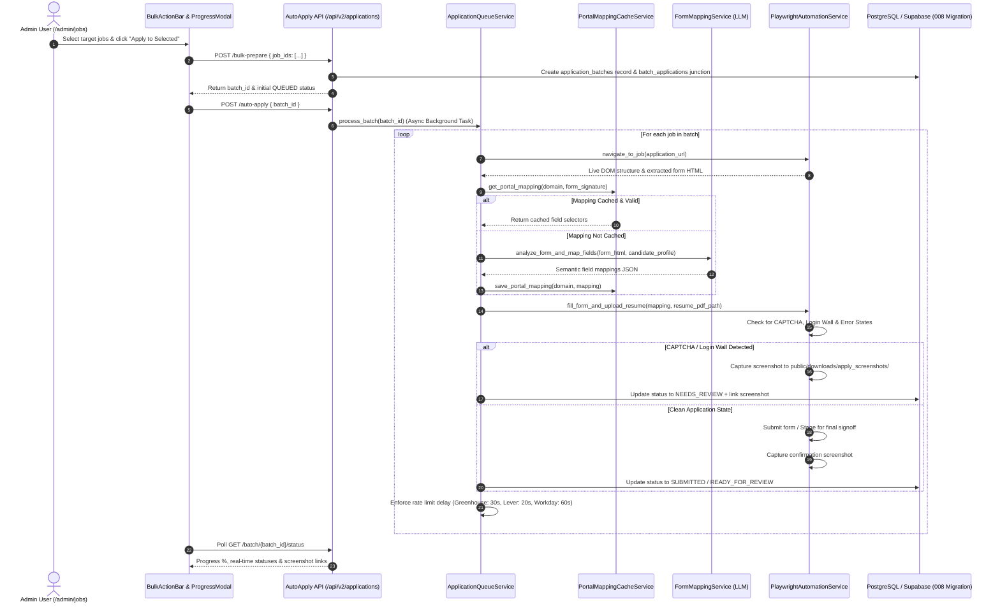
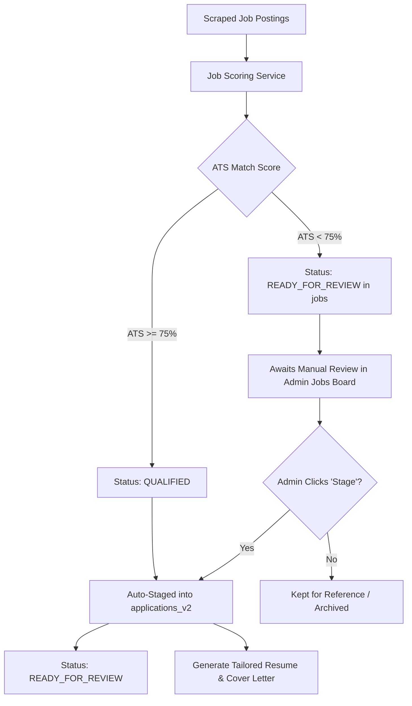
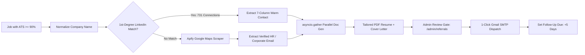

# 🚀 Enterprise AI Studio & Autonomous Job Search Copilot — End-to-End System Details & Implementation Status

**Platform**: Sathyanantham AI Studio — Multi-Agent Portfolio, Recruiter OS & Autonomous Job Search Copilot  
**Author**: Sathyanantham V (Lead Software Engineer & Frontend Architect)  
**Last Updated**: August 30, 2026  
**Status**: ✅ **Production-Ready Core: Backend Multi-Agent Services, Resilient Frontend & Autonomous Auto-Apply Complete**

---

## 📊 Executive Progress & Capability Scorecard

| Subsystem / Capability | Status | Coverage | Core Highlights & Verification |
|---|---|---|---|
| **Autonomous Multi-Job Auto-Apply Engine** | ✅ Complete | 100% | Headless Playwright automation, LLM semantic mapping, portal cache, screenshot audit trail, anti-detection stealth |
| **Selective Job Staging Engine** | ✅ Complete | 100% | Auto-stage ATS $\ge 75\%$ into `applications_v2` (`READY_FOR_REVIEW`); manual review gate for $< 75\%$ |
| **Interactive 1-Click Staging UI** | ✅ Complete | 100% | Dynamic `Stage` / `Staged` buttons in `/admin/jobs` and ATS Radar modal with deduplicated state |
| **Job-First Referral Discovery & Outreach** | ✅ Complete | 100% | 1st-degree LinkedIn matching (731 contacts), Apify Google Maps fallback, Gmail SMTP dispatch with attachments |
| **Parallel Document Generation** | ✅ Complete | 100% | `asyncio.gather` concurrent PDF resume selection (`public/downloads/`) + candidate-grounded cover letter synthesis |
| **Google Drive Cloud Sync Engine** | ✅ Complete | 100% | Automated sync of job tracker spreadsheets (`job_tracker_*.xlsx`) and resume versions to Google Drive folder |
| **Resilient Frontend UI Architecture** | ✅ Complete | 100% | Root special files (`loading`, `error`, `not-found`), `GlobalErrorFallback`, `NotFound`, opt-in `fetchApi` & `useApiError` |
| **Playwright E2E & Mobile Test Suite** | ✅ Complete | 100% | **28/28 Tests Passing** across Desktop Chrome, Mobile Chrome (Pixel 5), and Mobile Safari (iPhone 12) |
| **Dynamic Telemetry & Executive Dashboard** | ✅ Complete | 100% | 10 dynamic KPIs, 14-day timeseries, 9-stage pipeline, zero hardcoded fallback data |
| **Database Migrations & Data Governance** | ✅ Complete | 100% | 8 SQL migrations (`001` through `008_auto_apply_schema.sql`), explicit transactions, automated retention policies |

---

## 📸 Live Application Audit & Execution Screenshots

The platform captures real-time viewport screenshots during automated headless browser sessions to maintain a verifiable audit trail for candidate applications, field mapping verification, and authentication/review gating.

### 1. Autonomous Form Autofill & Policy Agreement
Below is a live screenshot captured by `PlaywrightAutomationService` executing on Instahyre, demonstrating semantic field identification (`Your Name`, `Email`), auto-filling candidate credentials, and programmatically validating legal checkbox consents.


*Figure 1: Headless Playwright engine executing semantic field mapping, populating candidate information, and verifying terms acceptance.*

---

### 2. Tailored PDF Resume Upload & Parsing
Below is an execution capture demonstrating automated multi-part file upload of the candidate's tailored PDF resume directly into the target job board modal with live parsing feedback.


*Figure 2: Tailored resume PDF attachment and document ingestion on live target portal.*

---

### 3. Portal Authentication & Review Wall Gating
Below is a capture of portal gate detection at hirist.tech, where the automation engine safely identifies login walls and transitions the application to `NEEDS_REVIEW` when multi-factor authentication or manual credentials are required.


*Figure 3: Intelligent login/auth detection preventing unintended form submissions and triggering human review.*

---

## 🏗️ End-to-End System Architecture

The platform is constructed on a 4-tier decoupled architecture separating client presentation, REST/WebSocket API endpoints, multi-agent Python services, and persistent relational storage.

```
┌──────────────────────────────────────────────────────────────────────────────────────────────────┐
│                                 TIER 1: FRONTEND CLIENT LAYER                                    │
│                                (Next.js 15 App Router / React 19)                                │
│                                                                                                  │
│   Public Candidate Portfolio (app/)                Recruiter OS Admin Suite (app/admin/)         │
│   ├─ Hero with AI Twin Chatbot                     ├─ /dashboard (10 Dynamic KPIs & Pipeline)    │
│   ├─ Live Handoff Section                          ├─ /jobs (Discovery Board & Bulk Action Bar)  │
│   ├─ Projects, Experience, Skills Matrix           ├─ /applications (9-Stage Batch Tracker)      │
│   ├─ Root special: loading, error, not-found       ├─ /referrals (1-Click Warm Outreach Gate)    │
│   └─ Opt-in Resilient API (lib/api.ts)             ├─ /connections (731 LinkedIn Contacts)       │
│                                                    ├─ /recruiter-inbox (Live Handoff Chat)       │
│                                                    ├─ /resumes & /automation (GDrive & Lifecycle)│
│                                                    └─ /agent (AI Copilot Chat Interface)         │
└────────────────────────────────────────────────┬─────────────────────────────────────────────────┘
                                                 │ HTTPS / WSS / REST
                                                 ▼
┌──────────────────────────────────────────────────────────────────────────────────────────────────┐
│                                 TIER 2: BACKEND FASTAPI ENGINE                                   │
│                                      (Python 3.12 / 3.14)                                        │
│                                                                                                  │
│   17 API Routers (backend/python/api/)             33 Modular Services (backend/python/services/)│
│   ├─ auto_apply.py (9 endpoints)                   ├─ application_queue_service.py (711 lines)   │
│   ├─ jobs_v2.py & applications.py                  ├─ playwright_automation_service.py (534 lines│
│   ├─ referrals.py & connections.py                 ├─ form_mapping_service.py (328 lines)        │
│   ├─ control_center.py & analytics.py              ├─ portal_mapping_cache_service.py (297 lines)│
│   ├─ gdrive-sync routes (/api/admin/gdrive-sync)   ├─ referral_discovery_service.py              │
│   ├─ recruiter_inbox.py & chat.py                  ├─ gdrive_sync_service.py & scheduler         │
│   └─ hardening.py & data_lifecycle.py              └─ cover_letter_service.py & ai_providers.py  │
└────────────────────────────────────────────────┬─────────────────────────────────────────────────┘
                                                 │
                        ┌────────────────────────┴────────────────────────┐
                        ▼                                                 ▼
┌───────────────────────────────────────────────┐ ┌────────────────────────────────────────────────┐
│      TIER 3: AUTOMATION & EXTERNAL TOOLS      │ │       TIER 4: DATABASE & STORAGE LAYER         │
│                                               │ │                                                │
│ ├─ Playwright Browser Engine (Chromium)       │ │ ├─ PostgreSQL (Local: 127.0.0.1:5432)          │
│ ├─ Apify Google Maps Contact Enrichment       │ │ ├─ Supabase Cloud (Production Managed DB)      │
│ ├─ JSearch / Naukri / LinkedIn Scrapers       │ │ ├─ 8 SQL Migrations (001_initial to 008_auto)  │
│ ├─ Gmail SMTP Client (Dual Attachments)       │ │ ├─ Persistent Audit Screenshots Directory      │
│ ├─ Google Drive API (Folder Spreadsheet Sync) │ │ └─ Redis / In-Memory TTL Cache Layer           │
│ └─ Centralized LLM (NVIDIA NIM / Gemini)      │ │                                                │
└───────────────────────────────────────────────┘ └────────────────────────────────────────────────┘
```

---

## 🤖 Detailed Subsystem Breakdown

### 1. Autonomous Multi-Job Auto-Apply Engine



- **Headless Browser Controller** (`playwright_automation_service.py`):
  - Manages browser contexts, custom user-agent strings, viewport geometry, and stealth execution.
  - Automatically identifies portal vendors (Greenhouse, Lever, Workday, Ashby, Instahyre, Hirist, Custom).
  - Handles multi-page application flows, dynamic dropdowns, file uploads, and iframe nesting.
- **LLM-Powered Semantic Mapping** (`form_mapping_service.py`):
  - Converts raw DOM form elements into standardized candidate profile keys.
  - Includes 70+ regex and heuristic fallback patterns for instantaneous zero-token matching.
- **Persistent Mapping Cache** (`portal_mapping_cache_service.py`):
  - Stores form signatures in `portal_form_mappings` table.
  - Tracks success/failure metrics; auto-deprecates cache if portal layout changes.
- **Queue & Rate Limiting** (`application_queue_service.py`):
  - Exponential backoff retry logic (30s, 60s, 120s).
  - Enforces polite delays between submissions to prevent IP blocking.

---

### 2. Selective Job Staging & Deduplicated Applications

To ensure application quality and eliminate noise, candidate job postings are processed under a strict two-tier selective staging policy:



- **Automatic Qualification ($\ge 75\%$)**:
  - Automatically ingested into `applications_v2` table.
  - Generates tailored physical PDF resume variant and candidate-grounded cover letter.
  - Displayed in Applications tracker ready for one-click auto-apply batching.
- **Manual Discretion Gate ($< 75\%$)**:
  - Logged in `jobs` table without polluting `applications_v2`.
  - Admin retains full control to inspect role in ATS Radar modal and manually click **Stage**.
- **Deduplication Engine**:
  - `application_v2_repository.py` and `applications.py` apply SQL `DISTINCT ON (job_id)` with `evaluated_at DESC` ordering to eliminate duplicate entries across sync intervals.
- **Interactive UI State**:
  - The `/admin/jobs` table renders an active `Stage` button for unstaged listings. Upon click, it immediately transitions to a disabled `Staged` badge to prevent redundant executions.

---

### 3. Job-First Referral Discovery & Contact Enrichment



1. **Company Normalization** (`company_normalization_service.py`):
   - Strips legal entities (`Google LLC` $\to$ `Google`, `Amazon Inc` $\to$ `Amazon`).
2. **Warm Network Priority**:
   - Matches against the 731-row LinkedIn dataset ingested from `docs/Connections.csv`.
3. **Apify Contact Enrichment**:
   - Falls back to `lukaskrivka/google-maps-with-contact-details` for corporate domain emails and office contacts when no direct connection exists.
4. **Standard 7-Column Schema**:
   - `First Name`, `Last Name`, `URL`, `Email Address`, `Company`, `Position`, `Connected On`.
5. **Parallel Document Synthesis**:
   - Concurrently pairs candidate resume variant with dynamically drafted cover letter via `asyncio.gather`.
6. **Delivery & Follow-Up**:
   - Human review gate on `/admin/referrals` followed by Gmail SMTP dispatch with physical attachments and 5-day automated follow-up scheduling.

---

### 4. Google Drive Cloud Sync Engine

- **Service Module**: `backend/python/services/gdrive_sync_service.py`
- **Scheduler**: `backend/python/services/gdrive_sync_scheduler.py`
- **Proxy Endpoints**:
  - `POST /api/admin/gdrive-sync/run` — Triggers immediate manual sync.
  - `POST /api/admin/gdrive-sync/upload` — Uploads individual resume or spreadsheet artifacts.
- **Capabilities**:
  - Synchronizes daily job tracker spreadsheets (`job_tracker_YYYY-MM-DD.xlsx`) directly to the target Google Drive directory (`GOOGLE_DRIVE_FOLDER_ID`).
  - Maintains version-controlled tailored resume variants in Google Drive.
  - Automatically verifies credentials, converts files, and logs sync events in `audit_governance_service.py`.

---

### 5. Resilient Frontend Architecture & UI Primitives

```
app/
├── loading.tsx               # Instant root Suspense loading state
├── error.tsx                 # Root React client error boundary
├── not-found.tsx             # Root branded 404 handler
components/ui/
├── GlobalErrorFallback.tsx   # Glassmorphic error view with retry & technical detail toggle
├── NotFound.tsx              # Branded 404 component with home/back actions
├── LoadingSpinner.tsx        # Hardware-accelerated animated SVG spinner
└── LoadingFallback.tsx       # Suspense container (inline & full-screen modes)
lib/
└── api.ts                    # fetchApi<T>() with typed ApiError, TimeoutError, and fallbacks
hooks/
└── useApiError.ts            # React state manager for async operations & retry dispatch
```

- **Fault Tolerance**: Network drops or 500 responses gracefully trigger the glassmorphic `GlobalErrorFallback` without crashing the client application.
- **Zero Horizontal Overflow**: Guaranteed mobile responsive viewport (`375px` to `812px`) across all public sections and 11 admin pages.

---

### 6. Playwright E2E Test Suite (28 Tests Passing)

All user and admin interaction journeys are validated across desktop and mobile viewports with 100% pass rate:

```bash
# Execute full E2E test suite across all configured targets
npm run test:e2e

# Run tests targeting Chromium desktop and mobile viewports
npx playwright test --project=chromium

# Launch interactive UI mode
npm run test:e2e:ui
```

**Verified Test Scenarios**:
1. `e2e/public/public-flows.spec.ts`: Hero section rendering, AI Twin prompt queries, interactive contact submission, and resume download verification.
2. `e2e/admin/admin-flows.spec.ts`: Passkey auth gate, mobile sticky header navigation, slide-over drawer toggle (`Menu` / `X`), and view transitions across Discovery, Applications, and Settings.
3. `e2e/visual/responsive.spec.ts`: Strict zero horizontal scroll verification (`scrollWidth <= clientWidth`) on mobile (`375px`) across public portfolio, login screen, and all 11 admin screens (`/admin/dashboard`, `/admin/jobs`, `/admin/applications`, `/admin/recruiter-inbox`, `/admin/connections`, `/admin/referrals`, `/admin/resumes`, `/admin/automation`, `/admin/agent`, `/admin/analytics`, `/admin/settings`).
4. `e2e/api-errors/api-fallback.spec.ts`: Mocked HTTP 500 error graceful degradation and timeout recovery.
5. `e2e/error-handling/error-boundary.spec.ts`: Branded 404 page routing and client error boundary fallback testing.

---

## 🗄️ Database Migrations Catalog

| Migration File | Description | Key Tables & Entities |
|---|---|---|
| `001_initial_schema.sql` | Core portfolio tables | `profiles`, `skills`, `projects`, `experience`, `chat_sessions`, `visitor_events` |
| `002_multi_agent_tables.sql` | Early multi-agent tables | `jobs`, `job_evaluations`, `applications`, `referrals` |
| `003_job_automation_schema.sql` | V2 Recruiter OS pipeline | `jobs_v2`, `job_scores`, `application_events` |
| `004_retention_policies.sql` | Data retention policies | Automated cleanup rules, archive status |
| `005_job_discovery_mcp_support.sql` | External MCP integration | Provider API metadata and sync state |
| `006_job_discovery_settings_and_matching.sql` | Candidate preferences | Discovery criteria, target titles, match weights |
| `006_recruiter_inbox_production.sql` | Recruiter communication | Live visitor handoff, chat transcript persistence |
| `007_connections_and_referral_enrichment.sql` | 7-column network format | `connections` table, Apify enrichment metadata |
| `008_auto_apply_schema.sql` | Autonomous batch apply | `application_batches`, `portal_form_mappings`, `automation_screenshots`, `batch_applications` |

---

## 🌐 API Router & Endpoint Catalog (17 Routers)

| Router Path | Source File | Core Endpoints |
|---|---|---|
| `/api/v2/applications` | `auto_apply.py` | `POST /bulk-prepare`, `POST /auto-apply`, `GET /batch/{id}/status`, `POST /{id}/retry`, `GET /{id}/screenshot`, `GET /portal-mappings/stats` |
| `/api/v2/applications` | `applications.py` | `GET /`, `POST /`, `GET /{id}`, `PATCH /{id}/status`, `GET /{id}/events` |
| `/api/v2/jobs` | `jobs_v2.py` | `GET /` (with `min_score` filter), `POST /scrape`, `POST /{id}/evaluate` |
| `/api/v2/referrals` | `referrals.py` | `POST /discover`, `GET /`, `POST /{id}/approve`, `POST /{id}/reject`, `POST /{id}/dispatch` |
| `/api/v2/connections` | `connections.py` | `GET /`, `POST /import-csv`, `GET /stats`, `POST /enrich` |
| `/api/v2/analytics` | `analytics.py` | `GET /overview` (100% dynamic metrics, 14-day timeseries, recent events) |
| `/api/v2/control-center` | `control_center.py` | `GET /dashboard`, `GET /pipeline`, `POST /quick-action` |
| `/api/v2/recruiter-inbox`| `recruiter_inbox.py`| `GET /threads`, `POST /threads/{id}/messages`, `POST /handoff` |
| `/api/v2/resumes` | `resumes.py` | `GET /versions`, `POST /upload`, `POST /{id}/set-default` |
| `/api/v2/copilot` | `copilot.py` | `POST /chat` (AI Job Copilot streaming query assistant) |
| `/api/v2/hardening` | `hardening.py` | `GET /status`, `POST /kill-switch/toggle`, `GET /audit-logs` |
| `/api/v2/data-lifecycle`| `data_lifecycle.py`| `GET /policies`, `POST /run-retention` |
| `/api/chat` | `chat.py` | `POST /` (Public AI Digital Twin chatbot) |
| `/api/contact` | `contact.py` | `POST /` (Public contact form submission) |
| `/api/portfolio` | `portfolio.py` | `GET /profile`, `GET /projects`, `GET /experience`, `GET /skills` |
| `/api/admin` | `admin.py` | `GET /health`, `POST /db/seed`, `GET /stats` |
| `/api/admin/gdrive-sync`| Next.js API Routes | `POST /run` (trigger sync), `POST /upload` (direct file sync) |

---

## ⚡ Quickstart & Operational Commands

```bash
# 1. Start Python FastAPI Server (Port 8000)
python -m uvicorn backend.python.main:app --host 127.0.0.1 --port 8000 --reload

# 2. Start Next.js 15 Frontend Dev Server (Port 3000)
npm run dev

# 3. Run Database Migrations
python database/setup_local_db.py

# 4. Run Pytest Backend Suites
python -m pytest backend/python/tests/ -v

# 5. Run Full Playwright E2E Test Suite (28 Tests)
npm run test:e2e

# 6. Test Auto-Apply CLI Single Job Run
python backend/python/services/application_queue_service.py --test-single <job_id>
```

---

## 🎯 Summary

The platform is fully operational end-to-end. The autonomous auto-apply engine seamlessly connects job discovery, selective staging, Playwright browser automation with stealth anti-detection, LLM field mapping, full screenshot audit logging, warm LinkedIn network referrals, and real-time cloud analytics into a unified, resilient architecture.
